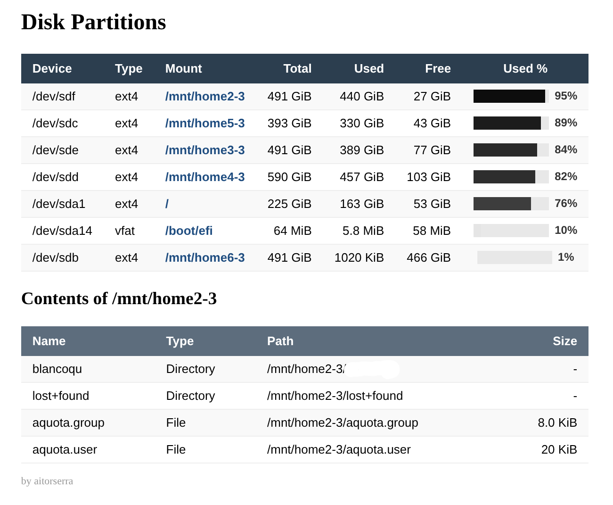

# Disk Usage Percentage - DirectAdmin Plugin

Plugin para el panel de administración DirectAdmin que muestra una tabla con todas las particiones de disco del servidor, indicando el tamaño total, el espacio ocupado y el porcentaje de uso. Al hacer click en un `Mount`, lista el contenido de esa ruta.

## Requisitos

- DirectAdmin instalado en el servidor
- `php-cli` disponible para el servicio de DirectAdmin
- `df` con soporte para `-P`, `-T` y `-k` (GNU coreutils en Linux)

## Instalación desde Plugin Manager

La forma recomendada es instalarlo directamente desde el **Plugin Manager** de DirectAdmin usando la URL pública del paquete, sin descargarlo ni copiar archivos a mano.

### Descarga directa

URL del paquete listo para instalar:

- `https://github.com/aitorserra/porcentaje_uso_de_disco_directadmin/raw/main/dist/disk_partitions.tar.gz`

### Instalación directa por URL en DirectAdmin

En **Admin Level > Plugin Manager**:

1. usa la opción que muestra `Paste URL to tar gzip file`
2. pega esta URL:

```text
https://github.com/aitorserra/porcentaje_uso_de_disco_directadmin/raw/main/dist/disk_partitions.tar.gz
```

3. instala el plugin

No hace falta descargar el fichero previamente ni subirlo manualmente si el servidor puede acceder a GitHub.

### Generar el paquete `.tar.gz` localmente

```bash
./package.sh
```

Esto crea un fichero en `dist/` con este formato:

```text
dist/disk_partitions.tar.gz
```

El paquete ya incluye:

- estructura correcta para DirectAdmin
- `plugin.conf`
- scripts de lifecycle
- permisos ejecutables en `admin/index.html` y `scripts/*.sh`
- detección automática y persistencia local de la ruta de `php-cli` durante la instalación

### Verificar el paquete antes de subirlo

```bash
./check-package.sh
```

La comprobación valida que el `.tar.gz` contiene:

- `plugin.conf` en la raíz del archivo
- punto de entrada `admin/index.html`
- renderer `admin/index.php`
- scripts `scripts/install.sh` y `scripts/uninstall.sh`
- icono `images/admin_icon.svg`
- permisos ejecutables correctos en los entrypoints

### Instalarlo desde DirectAdmin subiendo el archivo

En **Admin Level > Plugin Manager**:

1. usa la opción de subir/instalar plugin desde archivo
2. selecciona el `.tar.gz` generado
3. deja que DirectAdmin ejecute `scripts/install.sh`

No hace falta ningún `chmod`, copia manual ni ajuste posterior si el servidor tiene `php-cli` y `df`.

## Actualización

La actualización correcta del plugin debe hacerse desde el propio **Plugin Manager** usando el mecanismo de actualización del plugin, no intentando añadirlo otra vez como si fuera nuevo.

### Actualización recomendada

En **Admin Level > Plugin Manager**:

1. abre el plugin ya instalado
2. usa la acción de actualización que ofrece DirectAdmin para el plugin
3. DirectAdmin utilizará esta `update_url` definida en `plugin.conf`:

```text
https://github.com/aitorserra/porcentaje_uso_de_disco_directadmin/raw/main/dist/disk_partitions.tar.gz
```

### Actualización subiendo archivo

Si tu versión de DirectAdmin no ofrece actualización directa desde `update_url`, la alternativa práctica es:

1. genera el paquete nuevo con `./package.sh`
2. valida el paquete con `./check-package.sh`
3. desinstala el plugin actual
4. vuelve a instalarlo desde URL o desde el archivo nuevo

### Cuándo conviene desinstalar antes

- si cambias el `id` del plugin
- si añades migraciones o datos persistentes en futuras versiones
- si DirectAdmin deja restos de una versión anterior y detectas comportamiento incoherente

Con las versiones recientes de DirectAdmin, volver a usar `Paste URL to tar gzip file` sobre un plugin ya existente puede fallar con `Plugin with that ID already exists`, porque esa acción se trata como alta de plugin nuevo, no como actualización.

## Instalación manual

```bash
# Clonar el repositorio
git clone git@github.com:aitorserra/porcentaje_uso_de_disco_directadmin.git

# Copiar el plugin al directorio de plugins de DirectAdmin
cp -r porcentaje_uso_de_disco_directadmin/disk_partitions /usr/local/directadmin/plugins/

# Ejecutar el script de instalación del plugin
/usr/local/directadmin/plugins/disk_partitions/scripts/install.sh

# Reiniciar DirectAdmin
systemctl restart directadmin
```

O usando el script de instalación incluido:

```bash
bash install.sh
```

## Acceso

El plugin está disponible solo para el nivel **admin** de DirectAdmin:

- Menú lateral: **Disk Partitions**
- URL directa: `https://tudominio.com:2222/CMD_PLUGINS_ADMIN/disk_partitions`

## Columnas de la tabla

| Columna | Descripción |
|---------|-------------|
| Device  | Dispositivo de bloque (ej: `/dev/sda1`) |
| Type    | Tipo de filesystem (ej: `xfs`, `ext4`) |
| Mount   | Punto de montaje clickable para listar su contenido (ej: `/`, `/home`) |
| Total   | Tamaño total de la partición |
| Used    | Espacio ocupado |
| Free    | Espacio disponible |
| Used %  | Porcentaje de espacio usado con barra visual en escala de grises |

## Diseño accesible

La barra de porcentaje usado usa una **escala de grises**: más claro indica menos uso y más oscuro indica más uso. Esto es legible para personas con daltonismo.

## Comportamiento

- El plugin muestra solo filesystems relevantes para capacidad real y filtra pseudo-filesystems como `tmpfs`, `proc`, `sysfs`, `overlay` o `squashfs`.
- Las filas se ordenan por mayor porcentaje de uso para destacar antes las particiones con más riesgo.
- Al hacer click en un `Mount`, la interfaz recarga y lista el contenido legible de esa ruta debajo de la tabla.
- Si `php` o `df` no están disponibles, el plugin muestra un error visible en la interfaz en vez de fallar en silencio.
- La instalación guarda la ruta detectada de `php-cli` en el plugin para no depender del `PATH` del servicio de DirectAdmin.

## Desinstalación

```bash
/usr/local/directadmin/plugins/disk_partitions/scripts/uninstall.sh
rm -rf /usr/local/directadmin/plugins/disk_partitions
systemctl restart directadmin
```

## Licencia

MIT
